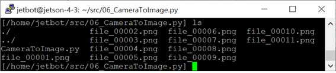
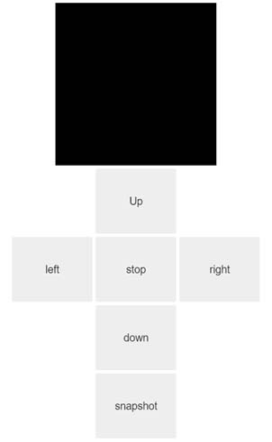

## 1. 참고 자료
--------------------------------------------------
- blackcode  
https://github.com/blackcoke/Proj_road_detection-  

- CSI-Camera  
https://github.com/JetsonHacksNano/CSI-Camera  
GStreamer를 이용해서 카메라 이미지 획득하는 방법 설명함  

 &nbsp; 

## 2. 프로그램 설치하기
--------------------------------------------------
$ sudo apt install ffmpeg  
$ sudo apt install v4l-utils  
$ sudo apt install tightvncserver  
$ sudo apt install libcanberra-gtk-module libcanberra-gtk3-module  

 &nbsp; 

> 참고 :  
> JetBot에서는 ffmpeg을 설치하면 OpenCV가 설치되므로 따로 설치하지 않아도 됨  
> JetBot에서 아래와 같이 OpenCV 설치 시 3.x 버전이 설치되어 카메라가 동작하지 않음  
> JetBot에서 opencv를 잘못 설치한 경우 sudo apt remove python3-open 와 같이 삭제하면 됨  

> import cv2  
> cv2.__version__ 값이 4.x 이면 됨  

>> $ sudo apt install python3-opencv -y (JetBot에서는 ffmpeg를 설치하면 됨. opencv 설치 할 필요 없음) 

## 3. 비디오 장치 정보 출력하기
--------------------------------------------------
$ sudo v4l2-ctl --list-devices
> vi-output, imx219 7-0010 (platform:54080000.vi:0):
>        /dev/video0

  

$ v4l2-ctl --device=/dev/video0 --all
> Driver Info (not using libv4l2):
>>        Driver name   : tegra-video
>>        Card type     : vi-output, imx219 7-0010
>>        Bus info      : platform:54080000.vi:0
>>        Driver version: 4.9.140

>>        Capabilities  : 0x84200001
>>>                Video Capture
>>>                Streaming
>>>                Extended Pix Format
>>>                Device Capabilities

>>        Device Caps   : 0x04200001
>>>                Video Capture
>>>                Streaming
>>>                Extended Pix Format
> Priority: 2

> Video input : 0 (Camera 0: no power)

> Format Video Capture:
>>        Width/Height      : 3264/2464
>>        Pixel Format      : 'RG10'
>>        Field             : None
>>        Bytes per Line    : 6528
>>        Size Image        : 16084992
>>        Colorspace        : sRGB
>>        Transfer Function : Default (maps to sRGB)
>>        YCbCr/HSV Encoding: Default (maps to ITU-R 601)
>>        Quantization      : Default (maps to Full Range)

 &nbsp; 

## 4. 카메라 테스트하기
--------------------------------------------------
- 카메라와 연결하기 위해 GStreamer 파이프라인을 구한다.

<pre>
(예)
# 모듈 불러오기
import cv2 as cv
import numpy as np
import os
import sys

# 매개변수 검사하기
g_bDisplay = 0

if len(sys.argv) > 1:
    g_bDisplay = int(sys.argv[1])

# img 출력하기
def ShowImage(str_title, img_data):
    if g_bDisplay:
        cv.imshow(str_title, img_data)

# 키 입력받기
def InputKey():
    keydata = 0
    if g_bDisplay:
        result = cv.waitKey(1)
    else:
        str = input("입력> ")
        keydata = str.strip()
        result = ord(keydata[0])

    print(result)
    return result

# GStreamer 파이프라인 얻기
def GetGstreamerPipeline(
    capture_width=640,
    capture_height=480,
    display_width=640,
    display_height=480,
    framerate=10,
    flip_method=0,
):
    return (
        "nvarguscamerasrc ! "
        "video/x-raw(memory:NVMM), "
        "width=(int)%d, height=(int)%d, "
        "format=(string)NV12, framerate=(fraction)%d/1 ! "
        "nvvidconv flip-method=%d ! "
        "video/x-raw, width=(int)%d, height=(int)%d, format=(string)BGRx ! "
        "videoconvert ! "
        "video/x-raw, format=(string)BGR ! appsink"
        % (
            capture_width,
            capture_height,
            framerate,
            flip_method,
            display_width,
            display_height,
        )
    )

# main 함수
def main():
    # 카메라 장치 얻기
    pipeline = GetGstreamerPipeline(640, 480, 640, 480, 10)

    # 비디오 장치 얻기
    cap = cv.VideoCapture(pipeline)

    while cap.isOpened():
        # 이미지 읽기
        result, img = cap.read()

        if result:
            ShowImage("TITLE", img)
        
        # 키 처리하기
        keydata = InputKey()
        if keydata == ord('q'):
            break

    # 해제하기
    if cap.isOpened():
        cap.release()

    cv.destroyAllWindows()

# 메인 함수 호출하기
if __name__ == "__main__":
    main()
</pre>

 &nbsp; 

## 5. 동영상 녹화하기
--------------------------------------------------
- JetBot에 ssh 로 접속해 실행한다. 
- 녹화 파일명, 녹화 시간을 지정하면 해당 시간 동안 동영상 파일을 만든다. 

$ python3 RecordVideo.py
> 녹화 파일명 : file.avi  
> 녹화 시간 (초단위 ): 10  

- 옵션 1을 주면 모니터 화면에서 녹화 화면을 볼 수 있다.

$ python3 RecordVideo.py 1
> 녹화 파일명 > file.avi  
> 녹화 시간 (초단위 ) > 10  

 &nbsp; 

## 6. 이미지 파일로 저장하기
--------------------------------------------------
- JetBot에 ssh 로 접속해 실행한다. 
- 파일명, 시간을 지정하면 해당 시간 동안 이미지 파일을 0.1ms 주기로 만든다. 

$ python CameraToImage.py

  

  

  

 &nbsp; 

## 7. 리모트 버튼 만들기
--------------------------------------------------

<pre>
# 모듈 불러오기
from jetbot import Camera
from jetbot import bgr8_to_jpeg
import ipywidgets.widgets as widgets
import cv2 as cv

# Push 버튼 프로시저
def button_proc(change):
    camera_image.value = bgr8_to_jpeg(camera.value)
    
# 카메라 객체 생성하기
camera = Camera.instance()

# 이미지 위젯 등록하기
camera_image = widgets.Image(format='jpeg', width=200, height=200)
 

# 버튼 레이아웃 설정하고 버튼 생성하기
layoutButton = widgets.Layout(width='100px', height='80px')
button_push = widgets.Button(description='Push', layout=layoutButton)

# 이미지 박스 만들고 이미지 출력하기
box = widgets.HBox([camera_image, button_push], layout=widgets.Layout(align_self='center'))
display(box)

# 버튼 이벤트 핸들러 설정하기
button_push.on_click(button_proc)
</pre>

  

 &nbsp; 

## 8. 리모트에서 JetBot으로 이미지 수집하기
--------------------------------------------------

<pre>
# 모듈 불러오기
from jetbot import Camera
from jetbot import bgr8_to_jpeg
import ipywidgets.widgets as widgets
from jetbot import Robot

import uuid
import time
import cv2 as cv
import os
import glob

# Robot 객체 생성하기
robot = Robot()

# Camera 객체 생성하기
camera = Camera.instance()

# 위젯 등록하기
camera_image = widgets.Image(format='jpeg', width=200, height=200)

# 버튼 레이아웃 설정하고 버튼 생성하기
layoutButton = widgets.Layout(width='100px', height='80px', align_self='center')

button_up = widgets.Button(description='Up', layout=layoutButton)
button_left = widgets.Button(description='left', layout=layoutButton)
button_stop = widgets.Button(description='stop', layout=layoutButton)
button_right = widgets.Button(description='right', layout=layoutButton)
button_down = widgets.Button(description='down', layout=layoutButton)
button_snapshot = widgets.Button(description='snapshot', layout=layoutButton)

# 카메라 이미지 저장하기
def take_snapshot(img_data):
    # 현재 디렉터리에서 jpg 파일의 개수 얻기
    strdir = os.getcwd()
    count = len(glob.glob(strdir + "/*.jpg"))
    
    # img_data를 JPEG 파일 형식으로 변환함
    camera_image.value = bgr8_to_jpeg(img_data)

    # JPEG 파일 저장하기
    if snapshot_on:
        # 파일 이름 설정하기
        strfile = strdir + "/%06d.jpg" %count
        with open(strfile, "wb") as f:
            f.write(img_data)

# 버튼 프로시저
def procButtonSnapshot(change):
    # 카메라 이미지 저장하기
    take_snapshot(camera.value)
        
def procButtonUp(change):
    global loop_count
    global sleep_value
    global sleep_left_value
    global sleep_right_value
    global snapshot_on
    
    # 모터 속도
    robot.set_motors(0.1, 0.1)
 
    local_count = loop_count
    while local_count > 0:
        time.sleep(sleep_up_down_value)
        take_snapshot(camera.value)
        local_count = local_count - 1
        
    robot.stop()
    
def procButtonDown(change):
    global loop_count
    global sleep_value
    global sleep_left_value
    global sleep_right_value
    global snapshot_on
    
    robot.set_motors(-0.1, -0.1)
 
    local_count = loop_count
    while local_count > 0:
        time.sleep(sleep_up_down_value)
        take_snapshot(camera.value)
        local_count = local_count - 1
        
    robot.stop()
    
def procButtonLeft(change):
    global loop_count
    global sleep_value
    global sleep_left_value
    global sleep_right_value
    global snapshot_on
    
    robot.set_motors(-0.1, 0.1)
 
    local_count = loop_count
    while local_count > 0:
        time.sleep(sleep_left_right_value)
        take_snapshot(camera.value)
        local_count = local_count - 1
        
    robot.stop()
    
def procButtonRight(change):
    global loop_count
    global sleep_value
    global sleep_left_value
    global sleep_right_value
    global snapshot_on
    
    robot.set_motors(0.1, -0.1)
 
    local_count = loop_count
    while local_count > 0:
        time.sleep(sleep_left_right_value)
        take_snapshot(camera.value)
        local_count = local_count - 1
        
    robot.stop()
    
def procButtonStop(change):
    robot.stop()

# 버튼 이벤트 핸들러 설정하기
button_up.on_click(procButtonUp)
button_down.on_click(procButtonDown)
button_left.on_click(procButtonLeft)
button_right.on_click(procButtonRight)
button_stop.on_click(procButtonStop)
button_snapshot.on_click(procButtonSnapshot)

# 매개변수 조정하기
loop_count = 5
sleep_up_down_value = 0.1
sleep_left_right_value = 0.01
snapshot_on = False

# 이미지 박스 만들고 이미지 출력하기
boxMiddle = widgets.HBox([button_left, button_stop, button_right], layout=widgets.Layout(align_self='center'))
box = widgets.VBox([camera_image, button_up, boxMiddle, button_down, button_snapshot], layout=widgets.Layout(align_self='center'))
display(box)

  

 &nbsp; 

</pre>